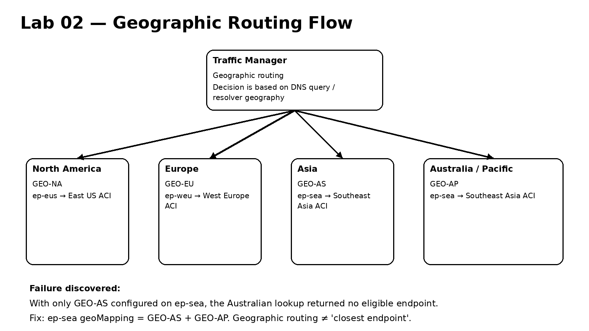
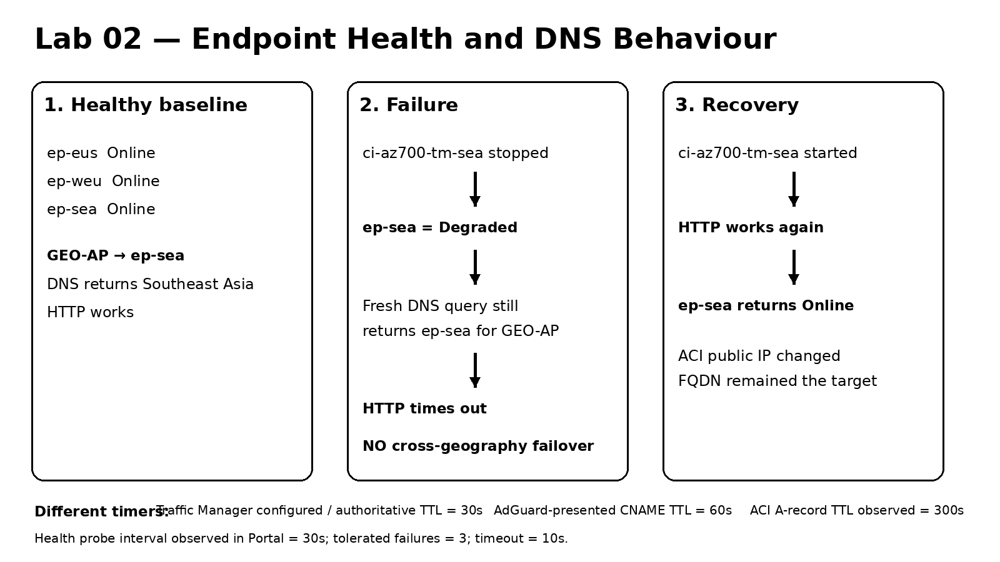
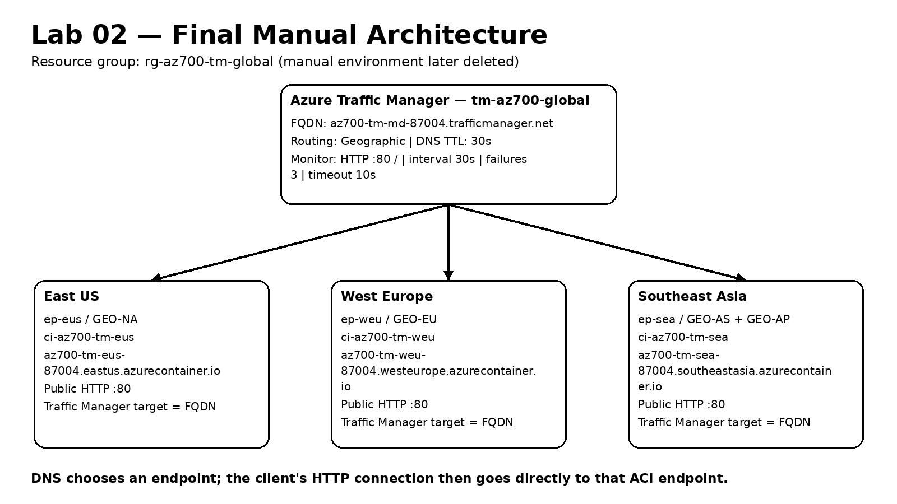

# Lab 02 - Azure Traffic Manager
## Rebuild and Practice Manual

**Programme:** Azure Networking Engineering Labs  
**Lab status:** COMPLETE  
**Primary service:** Azure Traffic Manager  
**Routing method:** Geographic  
**Application endpoints:** Azure Container Instances (ACI)  
**Automation:** Terraform + AzureRM 4.81.0  
**Completed:** 2026-08-30  

---

## 1. What this lab teaches

Lab 02 teaches global DNS-based traffic steering with Azure Traffic Manager. It deliberately builds on Lab 01, where Azure Load Balancer distributed Layer-4 flows inside a regional application path.

The essential distinction is:

```text
Azure Load Balancer
= regional Layer-4 flow distribution
= sits in the network/application data path

Azure Traffic Manager
= global DNS-based traffic steering
= does NOT proxy the final HTTP/HTTPS connection
= after DNS resolution the client connects directly to the chosen endpoint
```

The completed lab proves five engineering ideas:

1. Traffic Manager makes a DNS decision; it is not an inline reverse proxy.
2. Geographic routing uses explicit geography mappings, not a nearest-region algorithm.
3. The recursive DNS resolver location can influence the geography Traffic Manager evaluates.
4. Endpoint health and administrative enablement are separate states.
5. Terraform must be independently validated against real DNS, HTTP, Azure state, failure and recovery behaviour.


---

## 2. Final architecture

The original reference exercise used App Service endpoints in East US, West Europe and Southeast Asia. The subscription used for this lab had zero App Service VM quota, so App Service plan creation failed. Rather than abandon the networking lesson, the architecture was adapted to three lightweight Azure Container Instances registered as Traffic Manager External endpoints.

The final architecture was:

```text
                               Azure Traffic Manager
                                 tm-az700-global
                       az700-tm-md-87004.trafficmanager.net
                                    Geographic
                                        |
                 +----------------------+----------------------+
                 |                      |                      |
              GEO-NA                 GEO-EU             GEO-AS + GEO-AP
                 |                      |                      |
              ep-eus                 ep-weu                  ep-sea
                 |                      |                      |
       East US ACI endpoint     West Europe ACI       Southeast Asia ACI
```

Traffic Manager profile settings:

```text
Resource group:       rg-az700-tm-global
Traffic Manager:      tm-az700-global
Profile FQDN:         az700-tm-md-87004.trafficmanager.net
Routing method:       Geographic
Configured DNS TTL:   30 seconds
Monitor protocol:     HTTP
Monitor port:         80
Monitor path:         /
Probe interval:       30 seconds
Tolerated failures:   3
Probe timeout:        10 seconds
```

Regional endpoint mapping:

```text
North America (GEO-NA)     -> ep-eus -> East US ACI
Europe (GEO-EU)            -> ep-weu -> West Europe ACI
Asia (GEO-AS)              -> ep-sea -> Southeast Asia ACI
Australia/Pacific (GEO-AP) -> ep-sea -> Southeast Asia ACI
```



---

## 3. Pre-deployment checks

### 3.1 Confirm the Azure subscription

```powershell
az account show --query "{Subscription:name, SubscriptionId:id, TenantId:tenantId, IsDefault:isDefault}" -o table
```

Verify the intended subscription before creating potentially billable resources.

### 3.2 Verify required resource providers

```powershell
az provider list --query "[?namespace=='Microsoft.Web' || namespace=='Microsoft.Network'].{Provider:namespace,State:registrationState}" -o table
az provider show --namespace Microsoft.ContainerInstance --query "{Provider:namespace,State:registrationState}" -o table
```

Expected state is `Registered`.

### 3.3 Availability does not equal subscription quota

The source scenario used Linux App Service F1:

```powershell
az appservice list-locations --sku F1 --linux-workers-enabled -o table
```

East US, West Europe and Southeast Asia appeared, but App Service plan creation failed with:

```text
Operation cannot be completed without additional quota.
Current Limit (Total VMs): 0
Current Usage: 0
Amount required: 1
Minimum New Limit: 1
```

Lesson:

```text
Service/SKU listed as supported in a region
                  !=
Your subscription has usable quota/capacity there
```

Verify no partial plan remains:

```powershell
az appservice plan list --resource-group rg-az700-tm-global -o table
```

No partial App Service plan remained, so ACI was deliberately selected as the lightweight regional endpoint platform.

---

## 4. Manual Azure CLI build

### 4.1 Create the resource group

```powershell
az group create `
  --name rg-az700-tm-global `
  --location australiaeast `
  -o table
```

The resource-group location is metadata placement; it does not force all child resources into Australia East.

### 4.2 Use a unique DNS suffix

The completed lab used `87004`. For a repeat:

```powershell
$suffix = Get-Random -Minimum 10000 -Maximum 99999
$suffix
```

Use the same suffix consistently in ACI DNS labels and the Traffic Manager DNS name.

### 4.3 Create East US ACI

```powershell
az container create `
  --resource-group rg-az700-tm-global `
  --name ci-az700-tm-eus `
  --location eastus `
  --image mcr.microsoft.com/azuredocs/aci-helloworld `
  --os-type Linux `
  --cpu 0.5 `
  --memory 0.5 `
  --ports 80 `
  --ip-address Public `
  --dns-name-label "az700-tm-eus-87004" `
  -o table
```

A first live attempt omitted `--os-type Linux` and failed. ACI requires an explicit OS type.

```powershell
az container show --resource-group rg-az700-tm-global --name ci-az700-tm-eus --query "ipAddress.fqdn" -o tsv
curl.exe http://az700-tm-eus-87004.eastus.azurecontainer.io
```

### 4.4 Create West Europe ACI

```powershell
az container create `
  --resource-group rg-az700-tm-global `
  --name ci-az700-tm-weu `
  --location westeurope `
  --image mcr.microsoft.com/azuredocs/aci-helloworld `
  --os-type Linux `
  --cpu 0.5 `
  --memory 0.5 `
  --ports 80 `
  --ip-address Public `
  --dns-name-label "az700-tm-weu-87004" `
  -o table

curl.exe http://az700-tm-weu-87004.westeurope.azurecontainer.io
```

### 4.5 Create Southeast Asia ACI

```powershell
az container create `
  --resource-group rg-az700-tm-global `
  --name ci-az700-tm-sea `
  --location southeastasia `
  --image mcr.microsoft.com/azuredocs/aci-helloworld `
  --os-type Linux `
  --cpu 0.5 `
  --memory 0.5 `
  --ports 80 `
  --ip-address Public `
  --dns-name-label "az700-tm-sea-87004" `
  -o table

curl.exe http://az700-tm-sea-87004.southeastasia.azurecontainer.io
```

Validate all regional endpoints directly before introducing Traffic Manager.

---

## 5. Create and configure Traffic Manager

### 5.1 Create the Geographic profile

```powershell
az network traffic-manager profile create `
  --resource-group rg-az700-tm-global `
  --name tm-az700-global `
  --routing-method Geographic `
  --unique-dns-name az700-tm-md-87004 `
  --ttl 30 `
  --protocol HTTP `
  --port 80 `
  --path "/" `
  -o table
```

Verify rather than blindly rerunning a command if output is unclear:

```powershell
az network traffic-manager profile show `
  --resource-group rg-az700-tm-global `
  --name tm-az700-global `
  --query "{Name:name,Status:profileStatus,Routing:trafficRoutingMethod,FQDN:dnsConfig.fqdn,TTL:dnsConfig.ttl,Protocol:monitorConfig.protocol,Port:monitorConfig.port,Path:monitorConfig.path}" `
  -o table
```

### 5.2 Create External endpoints

```powershell
az network traffic-manager endpoint create `
  --resource-group rg-az700-tm-global `
  --profile-name tm-az700-global `
  --name ep-eus `
  --type externalEndpoints `
  --target az700-tm-eus-87004.eastus.azurecontainer.io `
  --geo-mapping GEO-NA `
  --endpoint-status Enabled `
  -o table
```

```powershell
az network traffic-manager endpoint create `
  --resource-group rg-az700-tm-global `
  --profile-name tm-az700-global `
  --name ep-weu `
  --type externalEndpoints `
  --target az700-tm-weu-87004.westeurope.azurecontainer.io `
  --geo-mapping GEO-EU `
  --endpoint-status Enabled `
  -o table
```

Initial Southeast Asia mapping:

```powershell
az network traffic-manager endpoint create `
  --resource-group rg-az700-tm-global `
  --profile-name tm-az700-global `
  --name ep-sea `
  --type externalEndpoints `
  --target az700-tm-sea-87004.southeastasia.azurecontainer.io `
  --geo-mapping GEO-AS `
  --endpoint-status Enabled `
  -o table
```

Verify:

```powershell
az network traffic-manager endpoint list `
  --resource-group rg-az700-tm-global `
  --profile-name tm-az700-global `
  --query "[].{Name:name,Health:endpointMonitorStatus,Status:endpointStatus,Target:target,Geo:geoMapping}" `
  -o table
```

Remember:

```text
EndpointStatus        = administrative state
EndpointMonitorStatus = health observed by Traffic Manager
```

---

## 6. Geographic routing troubleshooting from Australia

The first design mapped Southeast Asia only to `GEO-AS`.

```powershell
nslookup az700-tm-md-87004.trafficmanager.net
```

The Australian test path had no eligible endpoint because:

```text
Australia/Pacific = GEO-AP
Asia              = GEO-AS
```

Geographic routing does not mean “choose the nearest region”. Correct the mapping:

```powershell
az network traffic-manager endpoint update `
  --resource-group rg-az700-tm-global `
  --profile-name tm-az700-global `
  --name ep-sea `
  --type externalEndpoints `
  --geo-mapping GEO-AS GEO-AP `
  -o table
```

Retest:

```powershell
nslookup az700-tm-md-87004.trafficmanager.net
curl.exe http://az700-tm-md-87004.trafficmanager.net
```

Use both tests:

```text
nslookup = proves DNS steering selection
curl     = proves selected application endpoint reachability
```

Because every ACI served the same page, HTTP alone could not identify the selected geography.

---

## 7. Endpoint failure and recovery

Stop Southeast Asia:

```powershell
az container stop --resource-group rg-az700-tm-global --name ci-az700-tm-sea
```

Observed progression:

```text
Application stopped
-> HTTP failed immediately
-> Traffic Manager initially still showed Online
-> later ep-sea became Degraded
```

A fresh Google DNS query while degraded still returned Southeast Asia for Australia/Pacific:

```powershell
nslookup az700-tm-md-87004.trafficmanager.net 8.8.8.8
```

HTTP timed out.

Precise conclusion:

> In this Geographic-routing configuration, the observed Australian query did not cross-fail to Europe or North America when the mapped Southeast Asia endpoint became degraded.

Treat that as tested behavior for this lab topology, not as a universal statement about every possible Traffic Manager design.

Recover:

```powershell
az container start --resource-group rg-az700-tm-global --name ci-az700-tm-sea
```

Then re-test HTTP and endpoint health.



---

## 8. DNS TTL investigation

The profile was configured with a 30-second TTL.

Observed:

```text
Traffic Manager configured TTL       30s
Traffic Manager authoritative CNAME  30s
AdGuard recursive CNAME              60s
ACI A record                         300s
```

Use this wording:

> Traffic Manager was configured with a 30-second DNS TTL and its authoritative DNS returned 30 seconds. The AdGuard recursive resolver used by the workstation returned the record with a 60-second TTL, demonstrating that recursive DNS behaviour can affect the effective caching period seen by clients.

Do not claim an exact reason for the recursive resolver's 60-second value without evidence.

---

## 9. Portal inspection checklist

Verify:

- profile Enabled
- routing method Geographic
- location global
- DNS TTL 30 seconds
- monitor HTTP, port 80, path `/`
- probe interval 30 seconds
- tolerated failures 3
- timeout 10 seconds
- three External endpoints
- `ep-sea` has both Asia and Australia/Pacific mappings

```text
DNS TTL        = caching lifetime for DNS answers
Probe interval = endpoint-health checking cadence
```

---

## 10. Manual teardown

```powershell
az group delete --name rg-az700-tm-global --yes --no-wait
az group exists --name rg-az700-tm-global
```

The manual phase independently confirmed `false`, giving Terraform a clean environment to rebuild.

---

## 11. Terraform rebuild

### 11.1 File structure

```text
labs/02-traffic-manager/terraform/
|-- .terraform.lock.hcl
|-- README.md
|-- main.tf
|-- outputs.tf
|-- providers.tf
|-- terraform.tfvars.example
|-- variables.tf
`-- versions.tf
```

Provider baseline:

```text
Terraform required version: >= 1.6.0
AzureRM constraint:         ~> 4.0
Locked AzureRM version:     4.81.0
```

`versions.tf`:

```hcl
terraform {
  required_version = ">= 1.6.0"

  required_providers {
    azurerm = {
      source  = "hashicorp/azurerm"
      version = "~> 4.0"
    }
  }
}
```

`providers.tf`:

```hcl
provider "azurerm" {
  features {}
}
```

### 11.2 Variables

Defaults:

```hcl
resource_group_name     = "rg-az700-tm-global"
resource_group_location = "australiaeast"
dns_suffix              = "87004"
container_image         = "mcr.microsoft.com/azuredocs/aci-helloworld"
```

### 11.3 Regional data model

```hcl
locals {
  endpoints = {
    eus = {
      location       = "eastus"
      container_name = "ci-az700-tm-eus"
      dns_label      = "az700-tm-eus-${var.dns_suffix}"
      endpoint_name  = "ep-eus"
      geo_mappings   = ["GEO-NA"]
    }
    weu = {
      location       = "westeurope"
      container_name = "ci-az700-tm-weu"
      dns_label      = "az700-tm-weu-${var.dns_suffix}"
      endpoint_name  = "ep-weu"
      geo_mappings   = ["GEO-EU"]
    }
    sea = {
      location       = "southeastasia"
      container_name = "ci-az700-tm-sea"
      dns_label      = "az700-tm-sea-${var.dns_suffix}"
      endpoint_name  = "ep-sea"
      geo_mappings   = ["GEO-AS", "GEO-AP"]
    }
  }
}
```

`for_each` creates stable instances such as:

```text
azurerm_container_group.regional["eus"]
azurerm_container_group.regional["weu"]
azurerm_container_group.regional["sea"]
```

### 11.4 Resource group and ACI

```hcl
resource "azurerm_resource_group" "lab" {
  name     = var.resource_group_name
  location = var.resource_group_location
}

resource "azurerm_container_group" "regional" {
  for_each = local.endpoints

  name                = each.value.container_name
  location            = each.value.location
  resource_group_name = azurerm_resource_group.lab.name
  ip_address_type     = "Public"
  dns_name_label      = each.value.dns_label
  os_type             = "Linux"
  restart_policy      = "Always"

  container {
    name   = "web"
    image  = var.container_image
    cpu    = 0.5
    memory = 0.5

    ports {
      port     = 80
      protocol = "TCP"
    }
  }
}
```

Terraform builds dependencies from references, not file order.

### 11.5 Traffic Manager

```hcl
resource "azurerm_traffic_manager_profile" "global" {
  name                   = "tm-az700-global"
  resource_group_name    = azurerm_resource_group.lab.name
  traffic_routing_method = "Geographic"

  dns_config {
    relative_name = "az700-tm-md-${var.dns_suffix}"
    ttl           = 30
  }

  monitor_config {
    protocol                     = "HTTP"
    port                         = 80
    path                         = "/"
    interval_in_seconds          = 30
    timeout_in_seconds           = 10
    tolerated_number_of_failures = 3
  }
}
```

External endpoints:

```hcl
resource "azurerm_traffic_manager_external_endpoint" "regional" {
  for_each = local.endpoints

  name         = each.value.endpoint_name
  profile_id   = azurerm_traffic_manager_profile.global.id
  target       = azurerm_container_group.regional[each.key].fqdn
  enabled      = true
  geo_mappings = each.value.geo_mappings
}
```

The target uses each ACI FQDN rather than a transient observed public IP.

---

## 12. Terraform execution and results

```powershell
terraform init
terraform validate
terraform plan
```

Observed:

```text
Plan: 8 to add, 0 to change, 0 to destroy.
```

Eight resources:

```text
1 resource group
3 ACI container groups
1 Traffic Manager profile
3 Traffic Manager External endpoints
```

### Saved-plan PowerShell gotcha

This failed in the learner's environment:

```powershell
terraform plan -out=lab02.tfplan
```

with `Too many command line arguments`.

This succeeded:

```powershell
terraform plan -out lab02.tfplan
terraform apply lab02.tfplan
```

Observed:

```text
Apply complete! Resources: 8 added, 0 changed, 0 destroyed.
```

Outputs included:

```text
traffic_manager_fqdn = az700-tm-md-87004.trafficmanager.net

eus = az700-tm-eus-87004.eastus.azurecontainer.io
weu = az700-tm-weu-87004.westeurope.azurecontainer.io
sea = az700-tm-sea-87004.southeastasia.azurecontainer.io

EUS IP = 134.33.143.165
WEU IP = 132.220.34.199
SEA IP = 40.90.191.16
```

`terraform state list` contained exactly eight resource addresses.



---

## 13. Independent validation of Terraform

```powershell
az container list `
  --resource-group rg-az700-tm-global `
  --query "[].{Name:name,Location:location,FQDN:ipAddress.fqdn,IP:ipAddress.ip}" `
  -o table
```

The three ACI resources matched expected regions/FQDNs.

Australian DNS:

```powershell
nslookup az700-tm-md-87004.trafficmanager.net
```

selected Southeast Asia through `GEO-AP`.

HTTP:

```powershell
curl.exe http://az700-tm-md-87004.trafficmanager.net
```

returned the ACI welcome page.

A successful `terraform apply` is not enough; protocol and Azure-state validation prove the service actually behaves correctly.

---

## 14. Terraform-built failure/recovery test

```powershell
az container stop --resource-group rg-az700-tm-global --name ci-az700-tm-sea
```

Observed:

```text
HTTP through Traffic Manager -> failed
Traffic Manager ep-sea -> initially Online, later Degraded
Fresh Google DNS -> still SEA for GEO-AP
```

Recover:

```powershell
az container start --resource-group rg-az700-tm-global --name ci-az700-tm-sea
```

HTTP recovered.

Comparison:

```text
Manual stop/start:
SEA public IP changed from 40.119.253.24 to 20.197.126.249

Terraform-built stop/start:
SEA public IP remained 40.90.191.16
```

Correct conclusion: stop/start guarantees neither an IP change nor persistence. Use the ACI FQDN.

Final convergence:

```powershell
terraform plan
```

returned:

```text
No changes. Your infrastructure matches the configuration.
```

This proved desired configuration, Terraform state and live Azure configuration converged again after recovery.

---

## 15. Git/GitHub checkpoint

Reusable Terraform source and the provider lock file were committed without state, `.terraform/`, local secrets or saved plans.

```text
7891fe65064620480e2e1125f062f6138b08d3f5
Complete Lab 02 Terraform Traffic Manager rebuild
```

---

## 16. Final Terraform teardown

```powershell
terraform destroy
```

Observed:

```text
Destroy complete! Resources: 8 destroyed.
```

For every repeat, independently verify afterward:

```powershell
az group exists --name rg-az700-tm-global
terraform state list
```

Expected: `false` and no Terraform resource addresses.

The final chat did not separately capture those two outputs after the Terraform destroy, so this manual does not present them as observed final evidence.


---

## 17. Troubleshooting decision tree

### Traffic Manager name resolves but no endpoint address

Check profile status, endpoint enabled state, geography mapping, `GEO-AP` for Australia/Pacific, target FQDN, endpoint monitor health and recursive resolver behavior.

### DNS returns an endpoint but HTTP fails

Check direct endpoint reachability, container runtime, port 80, Traffic Manager health lag and whether the routing method actually provides the failover behavior you expect.

### Monitor says Online shortly after the app fails

Health probes use timers:

```text
probe interval = 30s
tolerated failures = 3
```

Application failure can precede a Degraded monitor state.

### Client sees a TTL different from 30 seconds

Compare profile configuration, authoritative Traffic Manager response, recursive resolver response, endpoint record TTL and local cache behavior.

### Terraform says duplicate required providers configuration

Keep provider requirement/configuration split cleanly:

```text
versions.tf  -> terraform { required_version + required_providers }
providers.tf -> provider "azurerm" { features {} }
```

Then:

```powershell
terraform validate
terraform plan
```

The corrected configuration returned no changes.

---

## 18. Condensed repeat runbook

```text
1. git pull --rebase
2. verify subscription and providers
3. create resource group
4. create three regional ACI endpoints
5. validate each ACI directly with curl
6. create Geographic Traffic Manager profile
7. create GEO-NA, GEO-EU, GEO-AS + GEO-AP mappings
8. verify endpoint health
9. test Australian DNS selection
10. test HTTP through Traffic Manager
11. stop Southeast Asia
12. observe health lag -> Degraded
13. query a fresh resolver
14. confirm HTTP failure
15. restart Southeast Asia and validate recovery
16. inspect TTLs and Portal settings
17. tear down manual environment and verify clean
18. terraform init
19. terraform fmt
20. terraform validate
21. terraform plan
22. terraform plan -out lab02.tfplan
23. terraform apply lab02.tfplan
24. verify Azure inventory
25. verify DNS + HTTP independently
26. repeat failure/recovery test
27. terraform plan -> expect no changes
28. commit/push reusable source
29. terraform destroy
30. verify resource group gone
31. verify Terraform state empty
```

---

## 19. Explain-back questions

1. Why is Traffic Manager not in the final HTTP data path?
2. Why can recursive-resolver location matter for Geographic routing?
3. Why did `GEO-AS` alone fail for the Australian test path?
4. How is Geographic routing different from Performance routing?
5. What is the difference between endpoint administrative status and monitor status?
6. Why can app failure precede `Degraded` health?
7. Why did the degraded SEA endpoint not result in Europe/North America in the observed test?
8. Why target ACI by FQDN instead of observed public IP?
9. What did manual vs Terraform stop/start teach about ACI IP persistence?
10. Why is `terraform apply` not sufficient network validation?
11. What does a final no-change plan prove after recovery?
12. Why commit `.terraform.lock.hcl` but not `terraform.tfstate`?
13. What are the eight Terraform-managed resources?
14. What two independent checks should follow `terraform destroy`?

---

## 20. Lab completion record

Lab 02 is complete.

```text
Mental model taught
-> manual Azure CLI build
-> real quota issue diagnosed
-> architecture adapted to ACI
-> regional endpoints validated
-> Geographic Traffic Manager configured
-> GEO-AP omission discovered and corrected
-> DNS + HTTP validated
-> endpoint failure/recovery tested
-> TTL layers investigated
-> Portal inspected
-> manual environment destroyed and independently verified
-> Terraform architecture built
-> plan showed 8 resources
-> saved plan applied: 8 added
-> Azure/DNS/HTTP independently validated
-> Terraform-built failure/recovery tested
-> final no-change plan confirmed convergence
-> Terraform code committed and pushed
-> final Terraform destroy: 8 resources destroyed
-> documentation and visual-learning closeout completed
```

**Next lab:** Lab 03 — IP Addressing, VNets, Subnets & Public IP Architecture.
